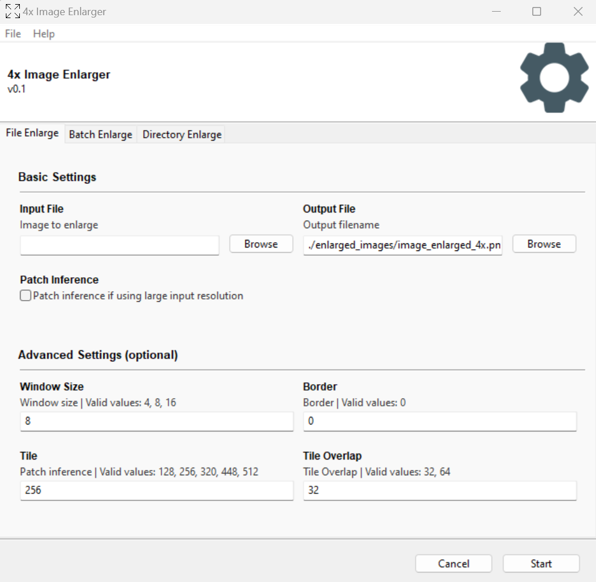

# 4x Image Enlarger
Enlarge any image by 4x. 



## Steps for Running Executables
1. For Windows, simply download and run [4xImageEnlarger.exe](https://github.com/scholarstree/4x-image-enlarger/releases/tag/exe) from releases.
2. For Linux and macOS, run using command line instead.

## Installation 
Clone 4x-image-enlarger git repository and enter the directory.

```
git clone https://github.com/scholarstree/4x-image-enlarger.git
cd 4x-image-enlarger
```

Create a virtual environment for python 3.6.

`conda create -n venv4x python=3.6`

Install requirements.

`pip install -r requirements.txt`

Download [model-4x.onnx from releases](https://github.com/scholarstree/4x-image-enlarger/releases/tag/models) and save it in models directory.

## Step for Running
To start the GUI run the following command:

`python enlarger_gooey.py`

There is also a basic script for testing. It enlarges a sample input file in images directory: 

`enlarger_basic.py`

## Steps for Creating Executables
Packaging has been tested for window, but should work for Linux and macOS as well. Replace SCRIPT_PATH, ONNXRUNTIME_DLL_PATH and IMAGES_PATH in build-win.spec. Then run:

`pyinstaller -F --onefile --windowed build-win.spec`

## About the Method
Enlargement is achieved using [SwinIR Enlargement](https://github.com/JingyunLiang/SwinIR) technique. Please refer for details about using settings.

## Caveats
1. Currently, only CPU inference is supported as ONNX GPU inference requires CUDA 11.x. A (200 x 200) image takes about a min, while a (900 x 900) image takes about 15 min. It's much faster using GPU, you can try running basic script in colab. For that you'd have to install onnxruntime-gpu `pip install onnxruntime-gpu` and uncomment lines in the scipt related to ONNX session creation. 
2. Due to Gooey limitation, variables after a run cannot be retained for another run. Therefore onnx model will be loaded everytime Start button is clicked. This takes about 40 sec.
